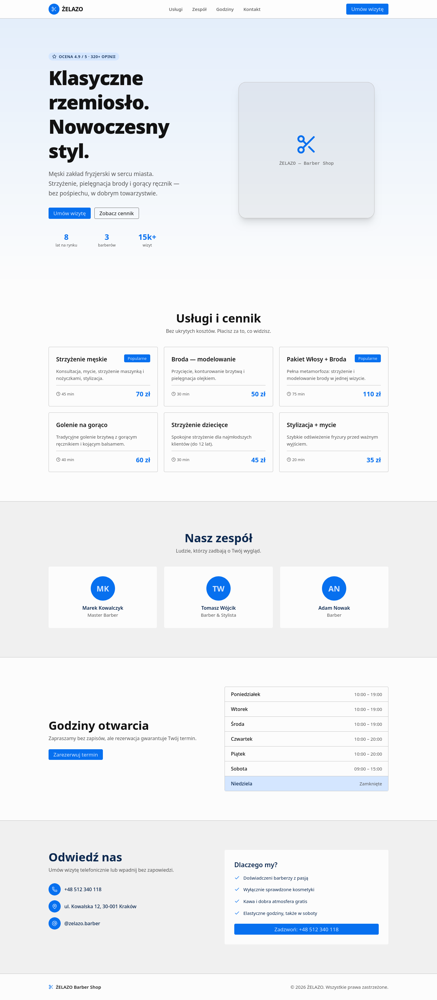
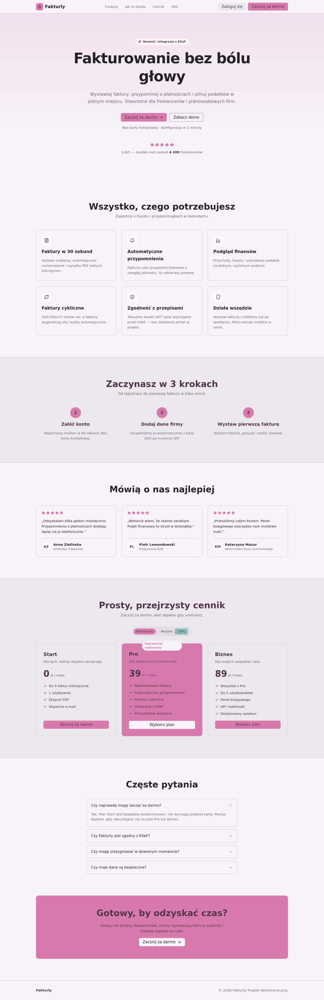
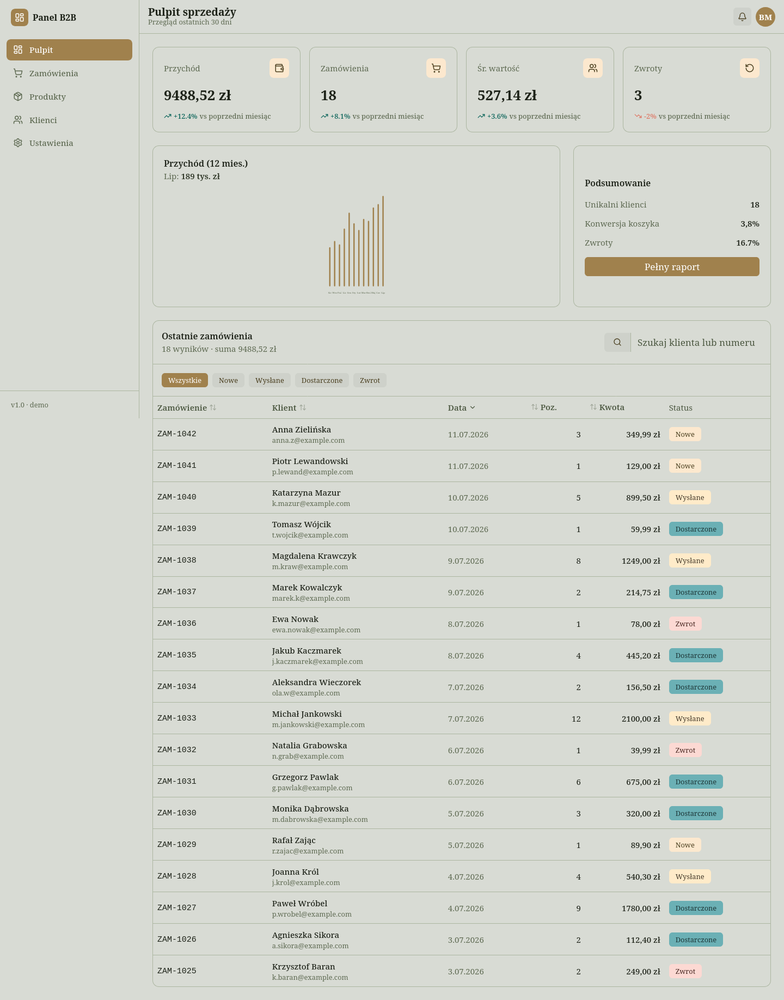

<h1 align="center">Przykładowe realizacje · Dragoon</h1>

<p align="center">
  Zestaw trzech kompletnych projektów demonstracyjnych — po jednym na każdą
  usługę z mojego portfolio. Każdy to osobny, działający projekt oparty o
  <strong>SvelteKit · Svelte 5 · TypeScript · Tailwind CSS v4 · Skeleton UI v4 · pnpm</strong>.
</p>

<p align="center">
  🌐 <a href="https://dragoon.beniaminm4.workers.dev/">Moje portfolio</a>
</p>

---

## Projekty

| Projekt | Usługa | Opis |
| :-- | :-- | :-- |
| [**single-page-fryzjer**](./single-page-fryzjer) | Single Page | Strona-wizytówka salonu barberskiego „ŻELAZO" — hero, cennik, zespół, godziny, kontakt. |
| [**landing-page-saas**](./landing-page-saas) | Landing Page | Strona sprzedażowa SaaS „Fakturly" — nastawiona na konwersję: interaktywny cennik, FAQ, dowód społeczny. |
| [**svelte-app-dashboard**](./svelte-app-dashboard) | Svelte App | Interaktywny panel sprzedaży — KPI, wykres SVG, tabela z wyszukiwaniem, filtrowaniem i sortowaniem. |

Każdy folder zawiera własne `README.md` ze zrzutami ekranu, animacją prezentującą
stronę oraz opisem, jaki problem rozwiązuje.

## Podgląd

<p align="center">
  
  
  
</p>

## Uruchomienie dowolnego projektu

```bash
cd single-page-fryzjer     # lub landing-page-saas / svelte-app-dashboard
pnpm install
pnpm dev                   # http://localhost:5173
```

## Stack

- **SvelteKit** + **Svelte 5** (runes: `$state`, `$derived`)
- **TypeScript**
- **Tailwind CSS v4** + **Skeleton UI v4**
- **pnpm**
- Ikony: `@lucide/svelte`

---

<p align="center"><sub>Projekty demonstracyjne. Dane (ceny, klienci, opinie) są fikcyjne.</sub></p>
