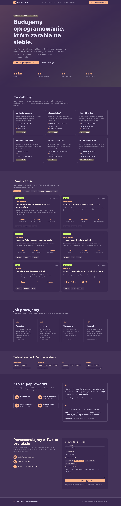
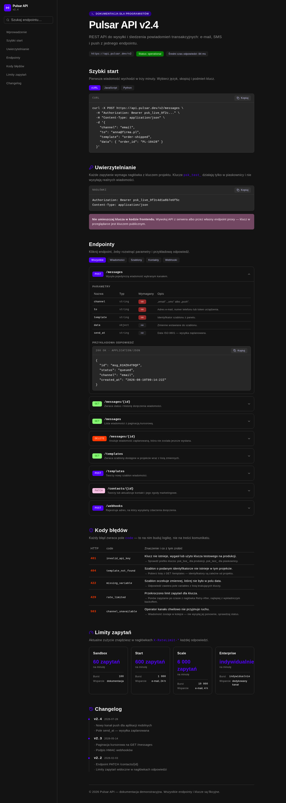
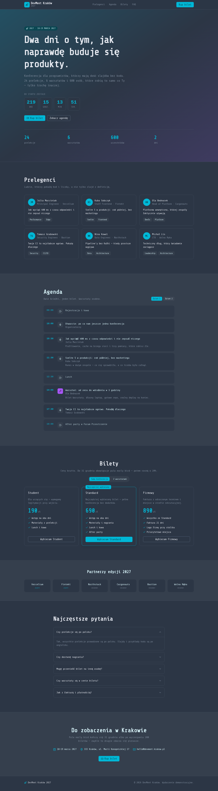
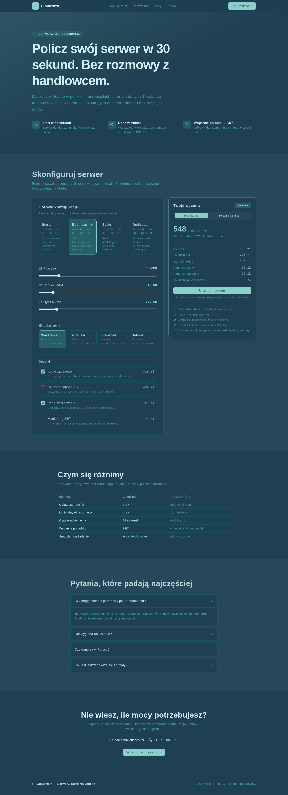

<h1 align="center">Przykładowe realizacje · Dragoon</h1>

<p align="center">
  <a href="#polski">🇵🇱 Polski</a> · <a href="#english">🇬🇧 English</a>
</p>

<p align="center">
  
  
  
</p>
<p align="center">
  
  
  
  
</p>

---

<a id="polski"></a>

## 🇵🇱 Polski

Zestaw siedmiu kompletnych projektów demonstracyjnych — od strony-wizytówki po
interaktywny konfigurator produktu. Każdy to osobny, działający projekt oparty o
**SvelteKit · Svelte 5 · TypeScript · Tailwind CSS v4 · Skeleton UI v4 · pnpm**.

🌐 **Portfolio:** [dragoon.beniaminm4.workers.dev](https://dragoon.beniaminm4.workers.dev/)
— wszystkie projekty **działają tam na żywo**, bez instalowania czegokolwiek.

### Projekty

| Projekt | Typ strony | Demo | Opis |
| :-- | :-- | :-- | :-- |
| [**single-page-fryzjer**](./single-page-fryzjer) | Single Page | [🔗](https://dragoon.beniaminm4.workers.dev/demo/zelazo/) | Strona-wizytówka salonu barberskiego „ŻELAZO" — hero, cennik, zespół, godziny, kontakt. |
| [**landing-page-saas**](./landing-page-saas) | Landing Page | [🔗](https://dragoon.beniaminm4.workers.dev/demo/fakturly/) | Strona sprzedażowa SaaS „Fakturly" — nastawiona na konwersję: interaktywny cennik, FAQ, dowód społeczny. |
| [**svelte-app-dashboard**](./svelte-app-dashboard) | Aplikacja / dashboard | [🔗](https://dragoon.beniaminm4.workers.dev/demo/panel/) | Interaktywny panel sprzedaży — KPI, wykres SVG, tabela z wyszukiwaniem, filtrowaniem i sortowaniem. |
| [**corporate-software-house**](./corporate-software-house) | Strona firmowa B2B | [🔗](https://dragoon.beniaminm4.workers.dev/demo/nexora/) | Witryna software house'u „Nexora Labs" — usługi z cenami, case studies z filtrem branż, proces, formularz zapytania. |
| [**docs-api-reference**](./docs-api-reference) | Dokumentacja techniczna | [🔗](https://dragoon.beniaminm4.workers.dev/demo/pulsar/) | Portal dokumentacji „Pulsar API" — wyszukiwarka endpointów, przykłady w 3 językach, kody błędów, changelog. |
| [**event-conference-it**](./event-conference-it) | Strona wydarzenia | [🔗](https://dragoon.beniaminm4.workers.dev/demo/devmeet/) | Konferencja „DevMeet Kraków" — licznik na żywo, agenda w zakładkach, bilety z opcją warsztatów, FAQ. |
| [**pricing-cloud-configurator**](./pricing-cloud-configurator) | Konfigurator produktu | [🔗](https://dragoon.beniaminm4.workers.dev/demo/cloudnest/) | Cennik chmury „CloudNest" — suwaki CPU/RAM/dysk, dodatki i wycena przeliczana na żywo. |

Każdy folder zawiera własne `README.md` (PL + EN) ze zrzutami ekranu, animacją
prezentującą stronę oraz opisem, jaki problem rozwiązuje.

### Uruchomienie dowolnego projektu

```bash
cd single-page-fryzjer     # albo dowolny inny katalog z tabeli powyżej
pnpm install
pnpm dev                   # http://localhost:5173
```

### Stack

- **SvelteKit** + **Svelte 5** (runes: `$state`, `$derived`)
- **TypeScript**
- **Tailwind CSS v4** + **Skeleton UI v4**
- **pnpm** · ikony: `@lucide/svelte`

---

<a id="english"></a>

## 🇬🇧 English

A set of seven complete demo projects — from a business-card site to an interactive
product configurator. Each is a standalone, working project built with
**SvelteKit · Svelte 5 · TypeScript · Tailwind CSS v4 · Skeleton UI v4 · pnpm**.

🌐 **Portfolio:** [dragoon.beniaminm4.workers.dev](https://dragoon.beniaminm4.workers.dev/)
— every project **runs live there**, with nothing to install.

### Projects

| Project | Site type | Demo | Description |
| :-- | :-- | :-- | :-- |
| [**single-page-fryzjer**](./single-page-fryzjer) | Single Page | [🔗](https://dragoon.beniaminm4.workers.dev/demo/zelazo/) | Business-card site for the "ŻELAZO" barber shop — hero, pricing, team, hours, contact. |
| [**landing-page-saas**](./landing-page-saas) | Landing Page | [🔗](https://dragoon.beniaminm4.workers.dev/demo/fakturly/) | "Fakturly" SaaS sales page — conversion-focused: interactive pricing, FAQ, social proof. |
| [**svelte-app-dashboard**](./svelte-app-dashboard) | App / dashboard | [🔗](https://dragoon.beniaminm4.workers.dev/demo/panel/) | Interactive sales dashboard — KPIs, SVG chart, table with search, filtering and sorting. |
| [**corporate-software-house**](./corporate-software-house) | B2B corporate site | [🔗](https://dragoon.beniaminm4.workers.dev/demo/nexora/) | "Nexora Labs" software house — priced services, case studies with an industry filter, process, RFP form. |
| [**docs-api-reference**](./docs-api-reference) | Technical documentation | [🔗](https://dragoon.beniaminm4.workers.dev/demo/pulsar/) | "Pulsar API" docs portal — endpoint search, samples in 3 languages, error codes, changelog. |
| [**event-conference-it**](./event-conference-it) | Event website | [🔗](https://dragoon.beniaminm4.workers.dev/demo/devmeet/) | "DevMeet Kraków" conference — live countdown, tabbed agenda, tickets with a workshop option, FAQ. |
| [**pricing-cloud-configurator**](./pricing-cloud-configurator) | Product configurator | [🔗](https://dragoon.beniaminm4.workers.dev/demo/cloudnest/) | "CloudNest" cloud pricing — CPU/RAM/disk sliders, add-ons and a price that updates live. |

Each folder has its own `README.md` (PL + EN) with screenshots, an animated
walkthrough and a description of the problem it solves.

### Run any project

```bash
cd single-page-fryzjer     # or any other directory from the table above
pnpm install
pnpm dev                   # http://localhost:5173
```

### Stack

- **SvelteKit** + **Svelte 5** (runes: `$state`, `$derived`)
- **TypeScript**
- **Tailwind CSS v4** + **Skeleton UI v4**
- **pnpm** · icons: `@lucide/svelte`

---

<p align="center"><sub>Projekty demonstracyjne — dane (ceny, klienci, opinie) są fikcyjne. · Demo projects — all data (prices, clients, reviews) is fictional.</sub></p>
