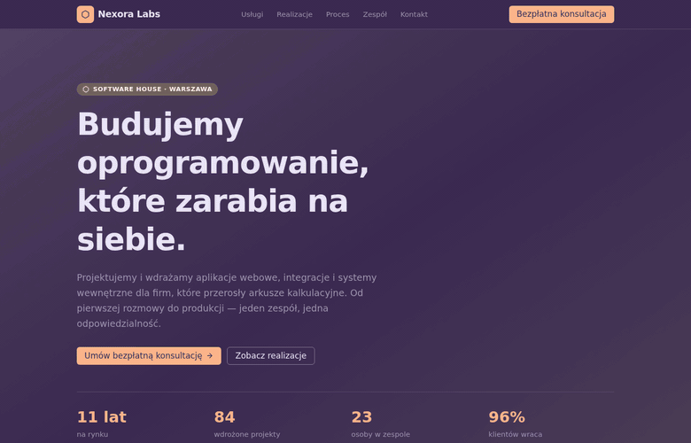

<h1 align="center">Nexora Labs — Software House</h1>
<p align="center"><strong>Strona firmowa</strong> · witryna korporacyjna B2B / corporate B2B website</p>

<p align="center">
  <a href="#polski">🇵🇱 Polski</a> · <a href="#english">🇬🇧 English</a>
</p>

<p align="center">
  
</p>

---

<a id="polski"></a>

## 🇵🇱 Polski

> 💡 Przykładowa realizacja strony firmowej dla branży IT — witryna, która sprzedaje
> usługi konkretnymi liczbami zamiast ogólników o „pasji do technologii".

### Czym jest ten projekt

Wielosekcyjna strona software house'u: oferta, realizacje z twardymi metrykami,
proces współpracy, technologie, zespół i formularz zapytania ofertowego. Wszystko
na jednej, szybkiej stronie — bez podstron, w których klient gubi wątek.

### Jaki problem rozwiązuje

Strony firm IT wyglądają niemal identycznie: stockowe zdjęcia, hasła o
„innowacyjnych rozwiązaniach" i zero dowodów. Ta strona robi inaczej:

- **Pokazuje dowody, nie deklaracje** — każda realizacja ma trzy mierzalne wyniki
  (np. „−62% telefonów do biura", „2,1 s → 0,6 s").
- **Filtruje realizacje po branży** — klient z logistyki w dwie sekundy znajduje
  projekt najbliższy swojemu.
- **Podaje widełki cenowe przy usługach** — odsiewa zapytania bez budżetu, zanim
  zajmą czas handlowca.
- **Zbiera kwalifikowany lead** — formularz pyta o budżet i zakres, więc pierwsza
  rozmowa zaczyna się od konkretów.

### Co zawiera strona

- **Hero** z hasłem, czterema statystykami i podwójnym CTA
- **Usługi** — sześć kart z zakresem i ceną wyjściową
- **Realizacje** — sześć case studies z **filtrem po branży** (Svelte 5 runes)
- **Proces** — cztery etapy współpracy z realnymi terminami
- **Technologie** — pogrupowany stack
- **Zespół i opinie** — twarze i cytaty zamiast anonimowej firmy
- **Formularz kontaktowy** z walidacją na żywo i wyborem przedziału budżetu
- Sticky nawigacja, menu mobilne, pełna responsywność

### Efekt dla klienta

Strona, którą można wysłać przed spotkaniem i która sama odpowiada na pytania
„co robicie", „dla kogo" i „ile to kosztuje" — a do skrzynki trafiają zapytania
z opisanym zakresem i budżetem.

---

<a id="english"></a>

## 🇬🇧 English

> 💡 An example corporate website for the IT industry — a site that sells services
> with concrete numbers instead of platitudes about "passion for technology".

### What this project is

A multi-section software-house website: services, case studies with hard metrics,
the delivery process, tech stack, team and a request-for-proposal form. All on one
fast page — no sub-pages for the client to get lost in.

### The problem it solves

IT company websites all look the same: stock photos, "innovative solutions" and no
evidence. This one does it differently:

- **Shows proof, not claims** — every case study carries three measurable results
  (e.g. "−62% calls to the office", "2.1 s → 0.6 s").
- **Filters case studies by industry** — a logistics client finds the closest
  project in two seconds.
- **States starting prices per service** — filters out no-budget enquiries before
  they eat sales time.
- **Collects a qualified lead** — the form asks about budget and scope, so the
  first call starts with specifics.

### What the page includes

- **Hero** with a claim, four stats and a dual CTA
- **Services** — six cards with scope and starting price
- **Case studies** — six of them with an **industry filter** (Svelte 5 runes)
- **Process** — four stages with realistic timelines
- **Tech stack** — grouped by area
- **Team and testimonials** — faces and quotes instead of an anonymous company
- **Contact form** with live validation and a budget selector
- Sticky navigation, mobile menu, fully responsive

### The outcome for the client

A site you can send before a meeting that answers "what do you do", "for whom" and
"what does it cost" on its own — while the inbox fills with enquiries that already
describe scope and budget.

---

<details>
<summary><strong>Szczegóły techniczne · Technical details</strong></summary>

**SvelteKit + Svelte 5 (runes) + TypeScript + Tailwind CSS v4 + Skeleton UI v4**
(motyw / theme `vox`), **pnpm**. Filtr realizacji i walidacja formularza w
`$state` / `$derived`, bez zewnętrznych bibliotek.

```bash
pnpm install
pnpm dev      # http://localhost:5173
pnpm build
pnpm check
```
</details>
