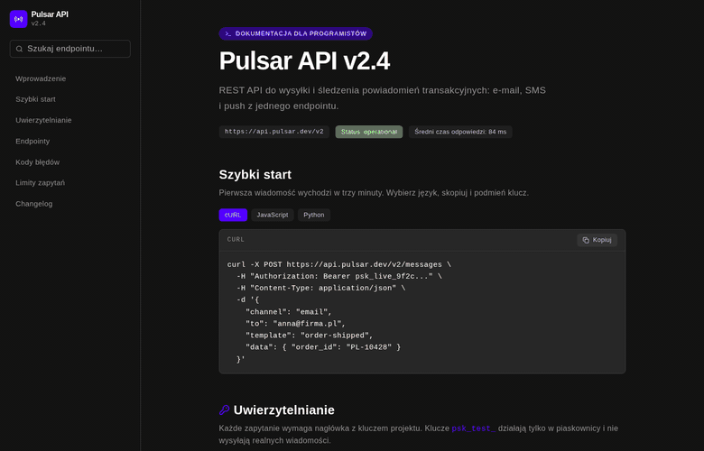

<h1 align="center">Pulsar API — dokumentacja techniczna</h1>
<p align="center"><strong>Dokumentacja</strong> · portal dla programistów / developer documentation portal</p>

<p align="center">
  <a href="#polski">🇵🇱 Polski</a> · <a href="#english">🇬🇧 English</a>
</p>

<p align="center">
  
</p>

---

<a id="polski"></a>

## 🇵🇱 Polski

> 💡 Przykładowa realizacja dokumentacji API — strona, na której programista klienta
> znajduje odpowiedź sam, zamiast pisać do wsparcia.

### Czym jest ten projekt

Portal z dokumentacją REST API: szybki start, uwierzytelnianie, referencja
endpointów, kody błędów, limity zapytań i changelog. Boczna nawigacja,
wyszukiwarka endpointów i przykłady kodu w trzech językach z kopiowaniem jednym
kliknięciem.

### Jaki problem rozwiązuje

Produkt techniczny bez dobrej dokumentacji sprzedaje się źle — integracja utyka na
pierwszym pytaniu, a zespół wsparcia odpowiada w kółko na to samo. Ta strona:

- **Skraca czas do pierwszego zapytania** — gotowy snippet w cURL, JavaScripcie
  albo Pythonie, do skopiowania jednym przyciskiem.
- **Pozwala znaleźć endpoint w sekundę** — wyszukiwarka podpowiada dopasowania
  podczas pisania, a filtry grupują endpointy tematycznie.
- **Odciąża wsparcie** — każdy kod błędu ma nie tylko opis, ale i podpowiedź, co z
  nim zrobić.
- **Buduje zaufanie** — widoczny status usługi, czas odpowiedzi i changelog
  pokazują, że produkt żyje.

### Co zawiera strona

- **Boczna nawigacja** z wyszukiwarką endpointów i podpowiedziami na żywo
- **Szybki start** — przełącznik języka (cURL / JavaScript / Python)
- **Bloki kodu** z przyciskiem „Kopiuj" i potwierdzeniem
- **Referencja endpointów** — rozwijane karty z tabelą parametrów i przykładową
  odpowiedzią, filtrowane po grupie
- **Kody błędów** — tabela HTTP → `code` → sposób obsługi
- **Limity zapytań** dla czterech planów oraz **changelog** wersji
- Osobny układ mobilny z chowanym menu, pełna responsywność

### Efekt dla klienta

Dokumentacja, którą można podlinkować w mailu do klienta technicznego — i wiedzieć,
że wróci z działającą integracją, a nie z listą pytań.

---

<a id="english"></a>

## 🇬🇧 English

> 💡 An example API documentation site — a page where the client's developer finds
> the answer alone instead of emailing support.

### What this project is

A REST API documentation portal: quickstart, authentication, endpoint reference,
error codes, rate limits and a changelog. Side navigation, endpoint search and code
samples in three languages with one-click copy.

### The problem it solves

A technical product with poor documentation sells badly — the integration stalls on
the first question and support answers the same thing over and over. This site:

- **Shortens time to first request** — a ready snippet in cURL, JavaScript or
  Python, copied with one button.
- **Finds an endpoint in a second** — search suggests matches as you type and
  filters group endpoints by topic.
- **Takes load off support** — every error code carries not just a description but
  what to do about it.
- **Builds trust** — visible service status, response time and a changelog show the
  product is alive.

### What the page includes

- **Side navigation** with endpoint search and live suggestions
- **Quickstart** — language switcher (cURL / JavaScript / Python)
- **Code blocks** with a "Copy" button and confirmation
- **Endpoint reference** — expandable cards with a parameter table and sample
  response, filtered by group
- **Error codes** — an HTTP → `code` → how-to-handle table
- **Rate limits** for four plans plus a version **changelog**
- A separate mobile layout with a collapsible menu, fully responsive

### The outcome for the client

Documentation you can link in an email to a technical client — knowing they'll come
back with a working integration rather than a list of questions.

---

<details>
<summary><strong>Szczegóły techniczne · Technical details</strong></summary>

**SvelteKit + Svelte 5 (runes) + TypeScript + Tailwind CSS v4 + Skeleton UI v4**
(motyw / theme `terminus`), **pnpm**. Wyszukiwarka, zakładki języków, rozwijane
endpointy i kopiowanie do schowka w `$state` / `$derived`.

```bash
pnpm install
pnpm dev      # http://localhost:5173
pnpm build
pnpm check
```
</details>
