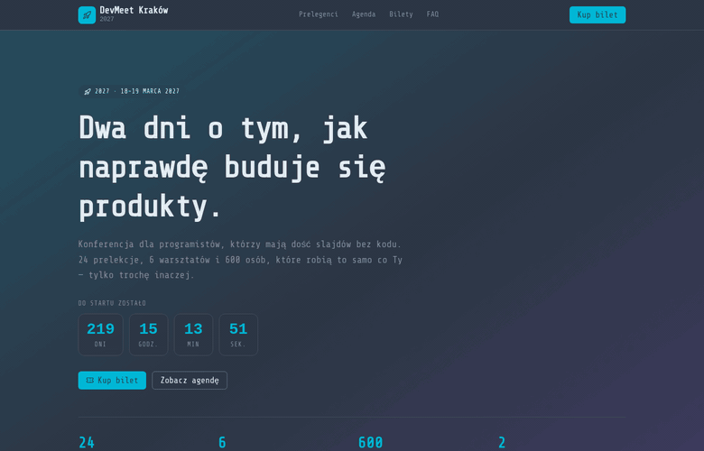

<h1 align="center">DevMeet Kraków — konferencja IT</h1>
<p align="center"><strong>Strona wydarzenia</strong> · event / conference website</p>

<p align="center">
  <a href="#polski">🇵🇱 Polski</a> · <a href="#english">🇬🇧 English</a>
</p>

<p align="center">
  
</p>

---

<a id="polski"></a>

## 🇵🇱 Polski

> 💡 Przykładowa realizacja strony wydarzenia — witryna, której jedynym zadaniem
> jest sprzedać bilet, zanim odwiedzający zamknie kartę.

### Czym jest ten projekt

Strona dwudniowej konferencji programistycznej: licznik do startu, prelegenci,
agenda z podziałem na dni, trzy rodzaje biletów z opcją warsztatów, partnerzy i
FAQ. Wszystko na jednej stronie, z przyciskiem zakupu zawsze pod ręką.

### Jaki problem rozwiązuje

Strony wydarzeń zwykle są PDF-em przerobionym na HTML — trudno znaleźć agendę, a
ceny biletów są na osobnej podstronie. Ta strona:

- **Buduje presję czasu uczciwie** — licznik odmierza czas do startu, a informacja
  o puli early bird mówi wprost, kiedy ceny rosną.
- **Pokazuje program bez klikania** — agenda z zakładkami dni mieści dwa dni
  wydarzenia w jednym widoku.
- **Ułatwia wybór biletu** — przełącznik „z warsztatami" natychmiast przelicza
  wszystkie trzy warianty.
- **Rozbraja wątpliwości** — FAQ odpowiada na pytania o faktury, nagrania i
  przeniesienie biletu, czyli na najczęstsze powody rezygnacji.

### Co zawiera strona

- **Hero** z **licznikiem odliczającym** do startu konferencji (na żywo)
- **Prelegenci** — sześć kart z tematem wystąpienia i tagami
- **Agenda** z zakładkami Dzień 1 / Dzień 2 i oznaczeniem ścieżek
  (prelekcja / warsztat / przerwa)
- **Bilety** — trzy pakiety z przełącznikiem „sama konferencja / z warsztatami"
  i natychmiastowym przeliczeniem ceny
- **Partnerzy**, rozwijane **FAQ** i sekcja z lokalizacją
- Sticky nawigacja, menu mobilne, pełna responsywność

### Efekt dla klienta

Jedna strona, którą wrzuca się w kampanię i social media — i która prowadzi
uczestnika od „co to jest" do „kupuję bilet" bez ani jednego przeładowania.

---

<a id="english"></a>

## 🇬🇧 English

> 💡 An example event website — a page whose only job is to sell a ticket before the
> visitor closes the tab.

### What this project is

A website for a two-day developer conference: a countdown, speakers, a day-by-day
agenda, three ticket tiers with a workshop option, partners and an FAQ. All on one
page, with the buy button always within reach.

### The problem it solves

Event sites are usually a PDF turned into HTML — the agenda is hard to find and
ticket prices live on a separate page. This one:

- **Creates urgency honestly** — a countdown to the start, and the early-bird note
  says plainly when prices go up.
- **Shows the programme without clicks** — a tabbed agenda fits both days into one
  view.
- **Makes ticket choice easy** — the "with workshops" toggle instantly recalculates
  all three tiers.
- **Defuses doubts** — the FAQ answers invoices, recordings and ticket transfers,
  the most common reasons people drop off.

### What the page includes

- **Hero** with a **live countdown** to the conference start
- **Speakers** — six cards with talk topic and tags
- **Agenda** with Day 1 / Day 2 tabs and track markers
  (talk / workshop / break)
- **Tickets** — three tiers with a "conference only / with workshops" toggle and
  instant price recalculation
- **Partners**, a collapsible **FAQ** and a venue section
- Sticky navigation, mobile menu, fully responsive

### The outcome for the client

One page you drop into a campaign and social media — one that walks the visitor
from "what is this" to "buying a ticket" without a single reload.

---

<details>
<summary><strong>Szczegóły techniczne · Technical details</strong></summary>

**SvelteKit + Svelte 5 (runes) + TypeScript + Tailwind CSS v4 + Skeleton UI v4**
(motyw / theme `rocket`), **pnpm**. Licznik na `$state` + `$effect`, agenda,
przełącznik biletów i FAQ na `$state` / `$derived`.

```bash
pnpm install
pnpm dev      # http://localhost:5173
pnpm build
pnpm check
```
</details>
