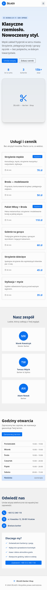

<h1 align="center">ŻELAZO — Barber Shop</h1>
<p align="center"><strong>Strona-wizytówka (Single Page)</strong> dla lokalnego biznesu usługowego.</p>

<p align="center">
  
</p>

> 💡 To przykładowa realizacja usługi **Single Page** — jedna, dopracowana strona,
> która w kilka sekund przedstawia firmę i zamienia odwiedzającego w klienta.

---

## Czym jest ten projekt

Nowoczesna, jednostronicowa witryna dla salonu fryzjerskiego. Cała oferta,
cennik, zespół, godziny otwarcia i kontakt są na jednym ekranie — klient nie musi
niczego szukać ani klikać w kolejne podstrony. Strona jest szybka, w pełni
responsywna (telefon, tablet, komputer) i gotowa do publikacji.

## Jaki problem rozwiązuje

Wiele lokalnych firm ma tylko profil w mediach społecznościowych — trudno tam
znaleźć cennik czy godziny, a wygląda to jak u konkurencji. Ta strona:

- **Buduje zaufanie** — profesjonalny wygląd i realne opinie („4.9/5") już w nagłówku.
- **Skraca drogę do rezerwacji** — przycisk „Umów wizytę" jest zawsze pod ręką
  (przyklejony pasek nawigacji + telefon jednym kliknięciem).
- **Odpowiada na pytania, zanim padną** — przejrzysty cennik i godziny otwarcia
  z automatycznym podświetleniem dnia dzisiejszego.
- **Działa na telefonie** — większość klientów szuka fryzjera „na już" z komórki.

## Podgląd

| Wersja desktop | Wersja mobilna |
| :---: | :---: |
|  |  |

## Co zawiera strona

- **Hero** z hasłem, statystykami (lata na rynku, liczba wizyt) i podwójnym CTA
- **Cennik usług** — czytelne karty z ceną, czasem i oznaczeniem „Popularne"
- **Zespół** — prezentacja barberów
- **Godziny otwarcia** — z podświetleniem bieżącego dnia
- **Kontakt** — telefon, adres, social oraz sekcja „Dlaczego my?"
- Płynne przewijanie, menu mobilne (hamburger), spójna kolorystyka

## Efekt dla klienta

Gotowa wizytówka firmy w internecie, którą można wysłać w SMS-ie, wpiąć w Google
i social media — i która realnie sprowadza rezerwacje.

---

<details>
<summary><strong>Szczegóły techniczne</strong></summary>

Zbudowane w **SvelteKit + Svelte 5 (runes) + TypeScript + Tailwind CSS v4 +
Skeleton UI v4** (motyw `cerberus`), zarządzane przez **pnpm**. Interaktywność
(menu mobilne, podświetlenie dnia) oparta o `$state` i `$derived`.

```bash
pnpm install
pnpm dev      # podgląd lokalny (http://localhost:5173)
pnpm build    # wersja produkcyjna
pnpm check    # kontrola typów
```
</details>
