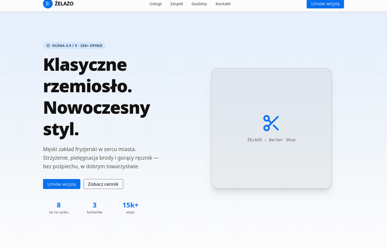

<h1 align="center">ŻELAZO — Barber Shop</h1>
<p align="center"><strong>Single Page</strong> · strona-wizytówka / one-page business-card site</p>

<p align="center">
  <a href="#polski">🇵🇱 Polski</a> · <a href="#english">🇬🇧 English</a>
</p>

<p align="center">
  
</p>

---

<a id="polski"></a>

## 🇵🇱 Polski

> 💡 Przykładowa realizacja usługi **Single Page** — jedna, dopracowana strona,
> która w kilka sekund przedstawia firmę i zamienia odwiedzającego w klienta.

### Czym jest ten projekt

Nowoczesna, jednostronicowa witryna dla salonu fryzjerskiego. Cała oferta,
cennik, zespół, godziny otwarcia i kontakt są na jednym ekranie — klient nie musi
niczego szukać ani klikać w kolejne podstrony. Strona jest szybka, w pełni
responsywna (telefon, tablet, komputer) i gotowa do publikacji.

### Jaki problem rozwiązuje

Wiele lokalnych firm ma tylko profil w mediach społecznościowych — trudno tam
znaleźć cennik czy godziny, a wygląda to jak u konkurencji. Ta strona:

- **Buduje zaufanie** — profesjonalny wygląd i realne opinie („4.9/5") już w nagłówku.
- **Skraca drogę do rezerwacji** — przycisk „Umów wizytę" jest zawsze pod ręką.
- **Odpowiada na pytania, zanim padną** — przejrzysty cennik i godziny otwarcia
  z automatycznym podświetleniem dnia dzisiejszego.
- **Działa na telefonie** — większość klientów szuka fryzjera „na już" z komórki.

### Co zawiera strona

- **Hero** z hasłem, statystykami i podwójnym CTA
- **Cennik usług** — czytelne karty z ceną, czasem i oznaczeniem „Popularne"
- **Zespół** — prezentacja barberów
- **Godziny otwarcia** — z podświetleniem bieżącego dnia
- **Kontakt** — telefon, adres, social oraz sekcja „Dlaczego my?"
- Płynne przewijanie, menu mobilne (hamburger), spójna kolorystyka

### Efekt dla klienta

Gotowa wizytówka firmy w internecie, którą można wysłać w SMS-ie, wpiąć w Google
i social media — i która realnie sprowadza rezerwacje.

---

<a id="english"></a>

## 🇬🇧 English

> 💡 An example of the **Single Page** service — one polished page that presents
> the business in seconds and turns a visitor into a customer.

### What this project is

A modern, single-page website for a barber shop. The full offer, pricing, team,
opening hours and contact all live on one screen — the client doesn't have to
search or click through sub-pages. The site is fast, fully responsive (phone,
tablet, desktop) and ready to publish.

### The problem it solves

Many local businesses only have a social-media profile — pricing and hours are
hard to find, and it looks just like the competition. This site:

- **Builds trust** — a professional look and real reviews ("4.9/5") right in the header.
- **Shortens the path to booking** — the "Book a visit" button is always within reach.
- **Answers questions before they're asked** — clear pricing and opening hours
  with the current day automatically highlighted.
- **Works on mobile** — most clients look for a barber "right now" from their phone.

### What the page includes

- **Hero** with a tagline, stats and a dual CTA
- **Service pricing** — clean cards with price, duration and a "Popular" badge
- **Team** — presentation of the barbers
- **Opening hours** — with the current day highlighted
- **Contact** — phone, address, social and a "Why us?" section
- Smooth scrolling, mobile menu (hamburger), consistent color scheme

### The outcome for the client

A ready online business card you can send in a text message, plug into Google and
social media — and that actually drives bookings.

---

<details>
<summary><strong>Szczegóły techniczne · Technical details</strong></summary>

**SvelteKit + Svelte 5 (runes) + TypeScript + Tailwind CSS v4 + Skeleton UI v4**
(motyw / theme `cerberus`), **pnpm**. Interaktywność / interactivity via `$state`
and `$derived`.

```bash
pnpm install
pnpm dev      # http://localhost:5173
pnpm build
pnpm check
```
</details>
