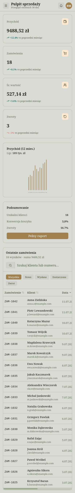

<h1 align="center">Panel sprzedaży — Aplikacja webowa (Svelte App)</h1>
<p align="center"><strong>Interaktywna aplikacja</strong> do zarządzania danymi w czasie rzeczywistym.</p>

<p align="center">
  
</p>

> 💡 To przykładowa realizacja usługi **Svelte App** — nowoczesna aplikacja webowa,
> a nie zwykła strona. Reaguje na działania użytkownika natychmiast, bez przeładowań.

---

## Czym jest ten projekt

Panel administracyjny sklepu (dashboard) do monitorowania sprzedaży. Pokazuje
najważniejsze wskaźniki, wykres przychodów oraz listę zamówień, którą można
**przeszukiwać, filtrować i sortować w locie**. To pełnoprawny interfejs aplikacji
biznesowej — taki sam mechanizm sprawdzi się w systemie rezerwacji, CRM-ie,
panelu klienta czy narzędziu wewnętrznym firmy.

## Jaki problem rozwiązuje

Dane w arkuszach Excela i rozproszonych systemach są trudne do ogarnięcia.
Dedykowany panel:

- **Pokazuje najważniejsze liczby od razu** — przychód, zamówienia, średnia
  wartość i zwroty jako kafelki KPI z trendem wzgl. poprzedniego miesiąca.
- **Pozwala szybko znaleźć to, czego szukasz** — wyszukiwarka i filtry statusu
  działają natychmiast, bez przeładowania strony.
- **Porządkuje pracę** — sortowanie kolumn (data, kwota, klient) jednym kliknięciem.
- **Wygląda profesjonalnie** — spójny interfejs, czytelne statusy, tryb mobilny.

## Podgląd

| Wersja desktop | Wersja mobilna |
| :---: | :---: |
|  |  |

## Co zawiera aplikacja

- **Kafelki KPI** — kluczowe wskaźniki liczone na bieżąco z danych
- **Wykres przychodów** (12 miesięcy) narysowany w czystym SVG, z interaktywnym
  najechaniem
- **Tabela zamówień** z pełną interaktywnością:
  - 🔎 wyszukiwanie po kliencie, numerze lub e-mailu
  - 🏷️ filtrowanie po statusie (Nowe / Wysłane / Dostarczone / Zwrot)
  - ↕️ sortowanie kolumn rosnąco i malejąco
- **Layout aplikacji** — składany panel boczny (mobile) i przyklejony górny pasek
- Formatowanie kwot i dat w polskiej lokalizacji

## Efekt dla klienta

Gotowy szkielet aplikacji biznesowej, który można podłączyć do realnych danych
(API/baza) i rozbudować o kolejne moduły — panel, który realnie przyspiesza pracę.

---

<details>
<summary><strong>Szczegóły techniczne</strong></summary>

Zbudowane w **SvelteKit + Svelte 5 (runes) + TypeScript + Tailwind CSS v4 +
Skeleton UI v4** (motyw `pine`), zarządzane przez **pnpm**. Wyszukiwanie,
filtrowanie i sortowanie zrealizowane reaktywnie przez `$state` i `$derived.by` —
bez żadnej zewnętrznej biblioteki do tabel czy wykresów.

```bash
pnpm install
pnpm dev      # podgląd lokalny (http://localhost:5173)
pnpm build    # wersja produkcyjna
pnpm check    # kontrola typów
```
</details>
