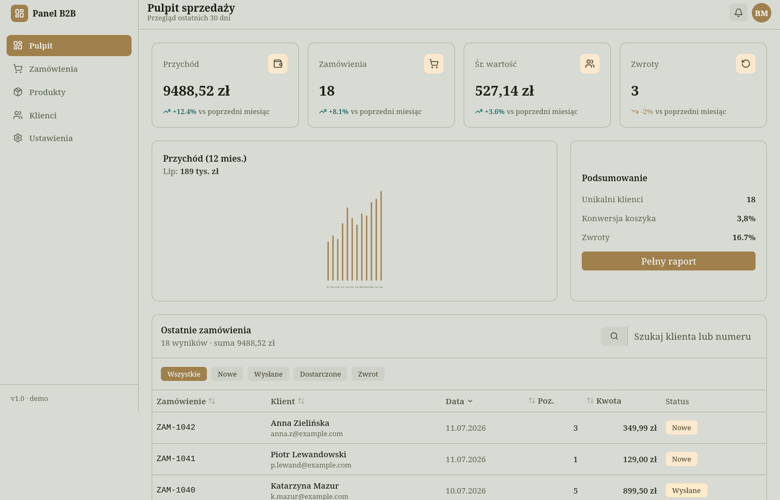

<h1 align="center">Panel sprzedaży — Svelte App</h1>
<p align="center"><strong>Svelte App</strong> · interaktywna aplikacja webowa / interactive web application</p>

<p align="center">
  <a href="#polski">🇵🇱 Polski</a> · <a href="#english">🇬🇧 English</a>
</p>

<p align="center">
  
</p>

---

<a id="polski"></a>

## 🇵🇱 Polski

> 💡 Przykładowa realizacja usługi **Svelte App** — nowoczesna aplikacja webowa,
> a nie zwykła strona. Reaguje na działania użytkownika natychmiast, bez przeładowań.

### Czym jest ten projekt

Panel administracyjny sklepu (dashboard) do monitorowania sprzedaży. Pokazuje
najważniejsze wskaźniki, wykres przychodów oraz listę zamówień, którą można
**przeszukiwać, filtrować i sortować w locie**. To pełnoprawny interfejs aplikacji
biznesowej — taki sam mechanizm sprawdzi się w systemie rezerwacji, CRM-ie,
panelu klienta czy narzędziu wewnętrznym firmy.

### Jaki problem rozwiązuje

Dane w arkuszach Excela i rozproszonych systemach są trudne do ogarnięcia.
Dedykowany panel:

- **Pokazuje najważniejsze liczby od razu** — przychód, zamówienia, średnia
  wartość i zwroty jako kafelki KPI z trendem wzgl. poprzedniego miesiąca.
- **Pozwala szybko znaleźć to, czego szukasz** — wyszukiwarka i filtry statusu
  działają natychmiast, bez przeładowania strony.
- **Porządkuje pracę** — sortowanie kolumn (data, kwota, klient) jednym kliknięciem.
- **Wygląda profesjonalnie** — spójny interfejs, czytelne statusy, tryb mobilny.

### Co zawiera aplikacja

- **Kafelki KPI** — kluczowe wskaźniki liczone na bieżąco z danych
- **Wykres przychodów** (12 miesięcy) narysowany w czystym SVG, z interaktywnym hoverem
- **Tabela zamówień** z pełną interaktywnością:
  - 🔎 wyszukiwanie po kliencie, numerze lub e-mailu
  - 🏷️ filtrowanie po statusie (Nowe / Wysłane / Dostarczone / Zwrot)
  - ↕️ sortowanie kolumn rosnąco i malejąco
- **Layout aplikacji** — składany panel boczny (mobile) i przyklejony górny pasek
- Formatowanie kwot i dat w polskiej lokalizacji

### Efekt dla klienta

Gotowy szkielet aplikacji biznesowej, który można podłączyć do realnych danych
(API/baza) i rozbudować o kolejne moduły — panel, który realnie przyspiesza pracę.

---

<a id="english"></a>

## 🇬🇧 English

> 💡 An example of the **Svelte App** service — a modern web application, not just
> a website. It responds to user actions instantly, with no page reloads.

### What this project is

An e-commerce admin panel (dashboard) for monitoring sales. It shows the key
metrics, a revenue chart and an orders list you can **search, filter and sort on
the fly**. It's a full-fledged business-app interface — the same mechanism works
for a booking system, a CRM, a client panel or an internal company tool.

### The problem it solves

Data scattered across Excel sheets and separate systems is hard to grasp.
A dedicated panel:

- **Shows the key numbers instantly** — revenue, orders, average value and
  returns as KPI tiles with a trend vs. the previous month.
- **Lets you find what you need fast** — search and status filters work
  instantly, with no page reload.
- **Organizes the work** — sort columns (date, amount, client) with one click.
- **Looks professional** — a consistent interface, clear statuses, mobile mode.

### What the app includes

- **KPI tiles** — key metrics computed live from the data
- **Revenue chart** (12 months) drawn in pure SVG, with an interactive hover
- **Orders table** with full interactivity:
  - 🔎 search by client, order number or e-mail
  - 🏷️ filter by status (New / Shipped / Delivered / Return)
  - ↕️ sort columns ascending and descending
- **App layout** — a collapsible sidebar (mobile) and a sticky top bar
- Currency and date formatting in the Polish locale

### The outcome for the client

A ready skeleton of a business application you can wire up to real data (API/DB)
and extend with further modules — a panel that genuinely speeds up the work.

---

<details>
<summary><strong>Szczegóły techniczne · Technical details</strong></summary>

**SvelteKit + Svelte 5 (runes) + TypeScript + Tailwind CSS v4 + Skeleton UI v4**
(motyw / theme `pine`), **pnpm**. Wyszukiwanie, filtrowanie i sortowanie /
search, filtering & sorting via `$state` and `$derived.by` — bez zewnętrznych
bibliotek / no external table or chart libraries.

```bash
pnpm install
pnpm dev      # http://localhost:5173
pnpm build
pnpm check
```
</details>
